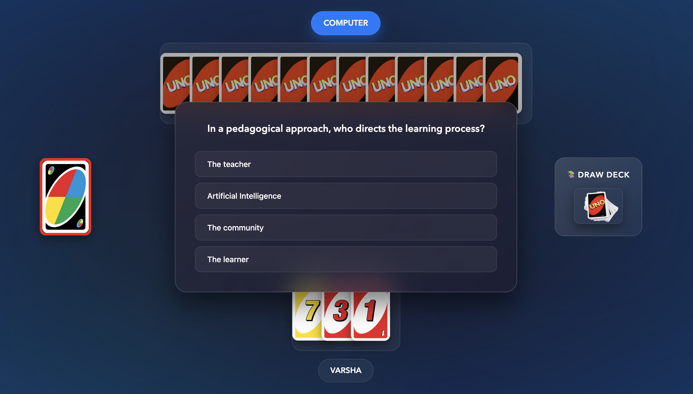

# UNO - THE QUIZMASTER EDITION 🧠🃏

**UNO - The Quizmaster Edition** takes the classic card game you love and supercharges it with a fun, educational twist! Test your knowledge of the Teaching-Learning Process while you try to outsmart the COMPUTER and be the first to empty your hand. This version features a sleek glassmorphism UI, engaging animations, and interactive quiz elements seamlessly woven into the gameplay.

🔴 **Technologies Used:** HTML5, CSS3, JavaScript (ES6)

---

✨ **Live Demo** ✨

[![Play Game Now!] (/Users/piyushtiwari/For_Projects/NIETT/UNO/play-here-uno.svg)
(https://piyushiitk24.github.io/UNO/)

---

<p align="center">
  
</p>

---

## 🚀 Welcome to UNO - The Quizmaster Edition!

Get ready for a unique UNO experience where strategy meets knowledge! This isn't just about matching colors and numbers; your understanding of educational concepts will be your greatest asset.

## 🎮 How This Game Works

The core objective remains the same: be the first player to get rid of all your cards. However, the "Quizmaster Edition" introduces special rules tied to questions about the Teaching-Learning Process:

#### 1.  **Game Start**
* The game prompts you for your name. The opponent is the "COMPUTER".
* Both you and the COMPUTER start with 7 cards.
* The player (you) goes first.

#### 2.  **Basic Gameplay**
* On your turn, match the top card on the Play Pile by **color** or **number**.
* You can also play an **Action Card** (Reverse, Skip, Draw 2) or a **Wild Card**.
* If you can't play a card,# UNO - THE QUIZMASTER EDITION 🧠🃏

**UNO - The Quizmaster Edition** takes the classic card game you love and supercharges it with a fun, educational twist! Test your knowledge of the Teaching-Learning Process while you try to outsmart the COMPUTER and be the first to empty your hand. This version features a sleek glassmorphism UI, engaging animations, and interactive quiz elements seamlessly woven into the gameplay.

🔴 **Technologies Used:** HTML5, CSS3, JavaScript (ES6)

---

✨ **Live Demo** ✨

[](https://piyushiitk24.github.io/UNO/)

---

<p align="center">
  
</p>

---

## 🚀 Welcome to UNO - The Quizmaster Edition!

Get ready for a unique UNO experience where strategy meets knowledge! This isn't just about matching colors and numbers; your understanding of educational concepts will be your greatest asset.

## 🎮 How This Game Works

The core objective remains the same: be the first player to get rid of all your cards. However, the "Quizmaster Edition" introduces special rules tied to questions about the Teaching-Learning Process:

#### 1.  **Game Start**
* The game prompts you for your name. The opponent is the "COMPUTER".
* Both you and the COMPUTER start with 7 cards.
* The player (you) goes first.

#### 2.  **Basic Gameplay**
* On your turn, match the top card on the Play Pile by **color** or **number**.
* You can also play an **Action Card** (Reverse, Skip, Draw 2) or a **Wild Card**.
* If you can't play a card, click the "Draw Deck" to draw one card, which ends your turn.

#### 3.  **🧠 The Quizmaster Twist!**
* **Escaping CPU's Cards:** If the COMPUTER plays an Action Card, a Wild Card, or an Even Numbered card on you, a question popup will appear!
    * ✅ **Answer Correctly:** You nullify the card's effect and the COMPUTER's turn is wasted!
    * ❌ **Answer Incorrectly:** You suffer the card's penalty (e.g., draw cards, skip turn). For Action/Wild cards, you draw **one extra card**, and for Even Number cards, you draw **two extra cards**.

#### 4.  **Winning the Game**
* The first player to empty their hand wins!
* When a player is down to their last card, the game automatically announces "UNO!".
* Each game is a fresh start; there is no cumulative scoring.

---
## 📸 Screenshots

| Welcome Screen | Game Rules | Name Submission |
| :---: | :---: | :---: |
|  |  |  |

| Main Gameplay | Question Popup |
| :---: | :---: |
|  |  |

---

## ✨ Features & Player Experience

* **Sleek Glassmorphism UI:** A modern and visually appealing interface with a cohesive purple gradient theme.
* **Interactive Effects:** Cards and buttons provide satisfying visual feedback on hover.
* **Engaging Animations:** Smooth animations for playing cards, drawing cards, and "UNO!" shouts.
* **Sound Effects:** Audio cues for all major game actions.
* **Responsive Design:** The interface adapts for enjoyable play on both desktop and mobile devices.
* **Quiz Integration:** Educational questions add a unique challenge and learning opportunity. Questions are cycled and won't repeat until the entire pool has been used.

---
## 🤖 How the COMPUTER Plays!

The COMPUTER isn't just playing random cards! It uses a dynamic strategy:

* **Identifies Playable Cards:** It scans its hand for all valid moves.
* **Strategic Decision:** It may play aggressively with high-value Action Cards if you have few cards left, or play conservatively to save its power plays for later.
* **Smart Color Choice:** When playing a Wild card, it intelligently picks the color that is most common in its remaining hand.

---

## 🛠️ Developer Mode / Keyboard Shortcuts

For testing or fun, you can use these keyboard shortcuts during the game:

* **P:** Force it to be the **P**layer's turn.
* **C:** **C**PU draws a card.
* **X:** Player discards the last card from their hand.
* **Z:** CPU discards the last card from its hand.
* **W:** Player receives a regular **W**ild card.
* **4:** Player receives a Wild Draw **4** card.
* **S:** Toggle visibility of the CPU's cards (**S**how/Hide).

---

## 🔧 Setup & How to Play Locally

While the game is best played online via the live demo link, you can also run it locally.

1.  **Clone the repository:**
    ```bash
    git clone [https://github.com/Piyushiitk24/UNO.git](https://github.com/Piyushiitk24/UNO.git)
    ```
2.  **Navigate to the project directory:**
    ```bash
    cd UNO
    ```
3.  **Run with a local server (Recommended):**
    * For the best experience (and to ensure all sounds and images load correctly), run `index.html` through a local server.
    * The easiest way is with the **Live Server** extension in Visual Studio Code.

---
## 🙏 Acknowledgements

* This project is an enhanced "Quizmaster Edition" based on the original UNO game logic and structure by **Abhishek Sharma** ([@abhisheks008](https://github.com/abhisheks008)).
* The current version, including the UI overhaul, quiz integration, and numerous enhancements, was developed by **Piyushi** ([@Piyushiitk24](https://github.com/Piyushiitk24)).

#### Show some ❤️ by starring the repository if you like this enhanced version! click the "Draw Deck" to draw one card, which ends your turn.

#### 3.  **🧠 The Quizmaster Twist!**
* **Escaping CPU's Cards:** If the COMPUTER plays an Action Card, a Wild Card, or an Even Numbered card on you, a question popup will appear!
    * ✅ **Answer Correctly:** You nullify the card's effect and the COMPUTER's turn is wasted!
    * ❌ **Answer Incorrectly:** You suffer the card's penalty (e.g., draw cards, skip turn). For Action/Wild cards, you draw **one extra card**, and for Even Number cards, you draw **two extra cards**.

#### 4.  **Winning the Game**
* The first player to empty their hand wins!
* When a player is down to their last card, the game automatically announces "UNO!".
* Each game is a fresh start; there is no cumulative scoring.

---

## 🃏 Special Card Effects

* **Draw 2 (+2):** Opponent draws 2 cards and forfeits their turn (unless quizzed correctly!).
* **Reverse/Skip:** In a 1v1 game, both act as a Skip. The opponent forfeits their turn (unless quizzed correctly!).
* **Wild Card:** Change the current color.
* **Wild Draw 4 (+4):** Change the color AND force the opponent to draw 4 cards (unless quizzed correctly!).

---
## 🤖 How the COMPUTER Plays!

The COMPUTER uses a dynamic strategy to challenge you:

* **Identifies Playable Cards:** It scans its hand for all valid moves.
* **Strategic Decision:** A random factor influences its choice. It may play aggressively with high-value Action Cards if you have few cards left, or play conservatively with low-number cards to save its power plays for later.
* **Smart Color Choice:** When playing a Wild card, it intelligently picks the color that is most common in its remaining hand.

---

## ✨ Features & Player Experience

* **Sleek Glassmorphism UI:** A modern and visually appealing interface with a cohesive purple gradient theme.
* **Interactive Effects:** Cards and buttons provide satisfying visual feedback on hover.
* **Engaging Animations:** Smooth animations for playing cards, drawing cards, and "UNO!" shouts.
* **Sound Effects:** Audio cues for all major game actions.
* **Responsive Design:** The interface adapts for enjoyable play on both desktop and mobile devices.
* **Quiz Integration:** Educational questions add a unique challenge and learning opportunity. Questions are cycled and won't repeat until the entire pool has been used.

---
## 🛠️ Developer Mode / Keyboard Shortcuts

For testing or fun, you can use these keyboard shortcuts during the game:

* **P:** Force it to be the **P**layer's turn.
* **C:** **C**PU draws a card.
* **X:** Player discards the last card from their hand.
* **Z:** CPU discards the last card from its hand.
* **W:** Player receives a regular **W**ild card.
* **4:** Player receives a Wild Draw **4** card.
* **S:** Toggle visibility of the CPU's cards (**S**how/Hide).

---

## 🔧 Setup & How to Play Locally

While the game is best played online via the live demo link, you can also run it locally.

1.  **Clone the repository:**
    ```bash
    git clone [https://github.com/Piyushiitk24/UNO.git](https://github.com/Piyushiitk24/UNO.git)
    ```
2.  **Navigate to the project directory:**
    ```bash
    cd UNO
    ```
3.  **Run with a local server (Recommended):**
    * For the best experience (and to ensure all sounds and images load correctly), run `index.html` through a local server.
    * The easiest way is with the **Live Server** extension in Visual Studio Code.

---
## 🙏 Acknowledgements

* This project is an enhanced "Quizmaster Edition" based on the original UNO game logic and structure by **Abhishek Sharma** ([@abhisheks008](https://github.com/abhisheks008)).
* The current version, including the UI overhaul, quiz integration, and numerous enhancements, was developed by **Piyushi** ([@Piyushiitk24](https://github.com/Piyushiitk24)).

#### Show some ❤️ by starring the repository if you like this enhanced version!